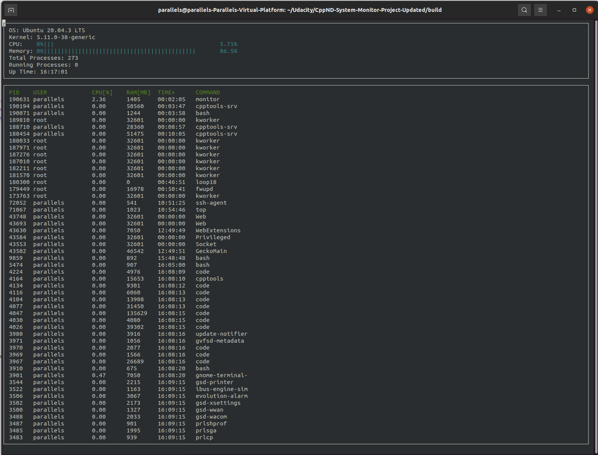

# CppND-System-Monitor

This is my implementation of the System Monitor Project in the Object Oriented Programming Course of the [Udacity C++ Nanodegree Program](https://www.udacity.com/course/c-plus-plus-nanodegree--nd213). 

Here is an image showing my implementation of the project.

The original README is [here](README.old.md)

# User interface

The following controls are available

<ul>
  <li>'a' - Sort processes in ascending order</li>
  <li>'d' - Sort processes in descending order</li>
  <li>'p' - Sort processes based on PID column</li>
  <li>'u' - Sort processes based on USER column</li>
  <li>'r' - Sort processes based on RAM column</li>
  <li>'c' - Sort processes based on CPU column</li>
  <li>'q' - Quit the program</li>
</ul>
